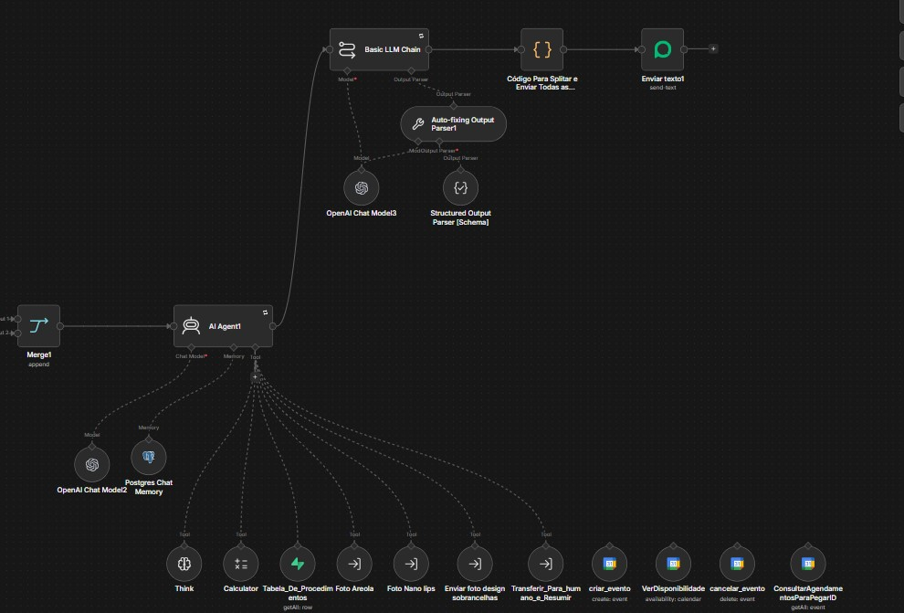
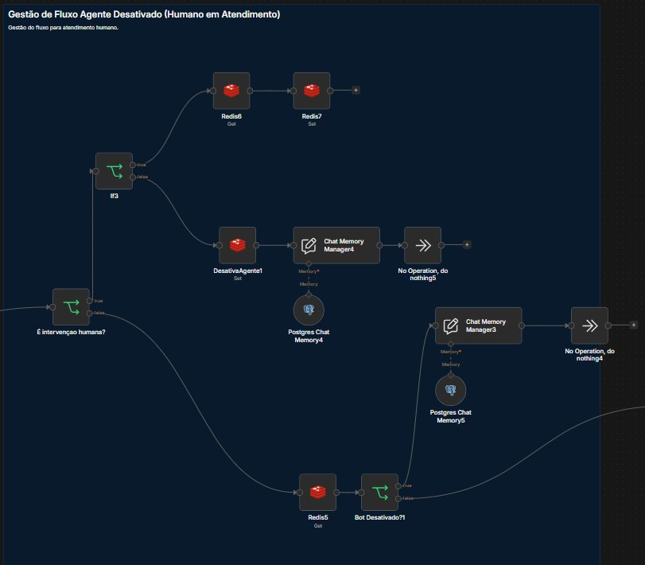
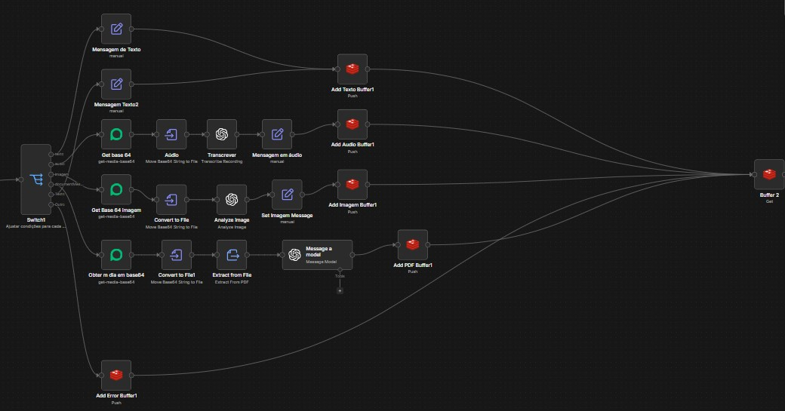

# Agente de IA — Clínica Estética (n8n)

Fluxo completo de atendimento via WhatsApp com Agente de IA para clínica estética. O agente **Sofia** recebe mensagens de clientes, realiza triagem de procedimentos, coleta dados de leads, gerencia memória de conversa e faz handoff para atendente humano no momento certo.

---

## Screenshots do Fluxo

<table>
  <tr>
    <td></td>
    <td></td>
  </tr>
  <tr>
    <td colspan="2"></td>
  </tr>
</table>

---

## Visão Geral do Fluxo

```
WhatsApp (Evolution API)
        │
        ▼
   Webhook n8n
        │
        ▼
┌───────────────────┐
│  Switch de Tipo   │  texto / áudio / imagem / outro
└───────────────────┘
        │
        ▼
┌───────────────────┐
│  Buffer (Redis)   │  agrupa mensagens em janela de tempo
└───────────────────┘
        │
        ▼
┌───────────────────┐
│  Verificações     │  bot ativo? intervenção humana? cliente existe?
└───────────────────┘
        │
        ▼
┌───────────────────┐     ┌──────────────────────┐
│  AI Agent (Sofia) │────▶│  Tools do Agente     │
│  GPT-4.1          │     │  • Tabela_Procedimentos│
└───────────────────┘     │  • Transferir_Humano  │
        │                 │  • Enviar Fotos       │
        ▼                 └──────────────────────┘
┌───────────────────┐
│  Memória          │  Postgres (Supabase) + buffer Redis
└───────────────────┘
        │
        ▼
   Resposta via WhatsApp
```

---

## Stack Tecnológica

| Componente | Tecnologia |
|---|---|
| Orquestração | n8n (self-hosted) |
| Modelo de IA | GPT-4.1 (OpenAI) |
| Buffer de mensagens | Redis |
| Memória de conversa | PostgreSQL via Supabase |
| Banco de leads | Supabase (tabela `Agente_IA_UsuariosLeads`) |
| Canal de entrada | WhatsApp via Evolution API |
| Parser de saída | Auto-fixing Output Parser + Structured Output Schema |

---

## Funcionalidades

### Triagem inteligente de procedimentos
O agente identifica o procedimento desejado e conduz uma triagem antes de apresentar qualquer valor ou realizar transferência:
- Sobrancelhas: primeira vez vs. micro anterior (com ou sem a clínica)
- Procedimentos paramédicos: tempo pós-cirúrgico
- Fotos de referência: agente solicita imagem quando necessário

### Buffer de mensagens (Redis)
Mensagens enviadas em sequência rápida são agrupadas antes de processar. Evita respostas fragmentadas para inputs como:
```
"Oi"
"quero fazer nano lips"
"tem horário amanhã?"
```
→ O agente recebe tudo junto e responde uma vez, de forma coerente.

### Gestão de leads (Supabase)
- Verifica se o contato já existe na base
- Cria novo registro automaticamente para leads novos
- Armazena nome, data de nascimento e e-mail coletados durante a conversa

### Memória de conversa (PostgreSQL)
Histórico persistido por sessão usando `Postgres Chat Memory`. O agente lembra o contexto de conversas anteriores do mesmo contato.

### Handoff para humano
Após coletar os dados obrigatórios (nome, data de nascimento, e-mail opcional), o agente executa a ferramenta `Transferir_Para_humano_e_Resumir` — que notifica o atendente com um resumo estruturado da conversa.

### Desativação do bot por atendente
Um atendente humano pode desativar o agente para determinado contato (enviando emoji configurado). O fluxo verifica esse estado no Redis antes de processar cada mensagem.

---

## Estrutura dos Nós Principais

```
Webhook
  └─ Switch1 (tipo de mensagem)
       ├─ texto   → Add Texto Buffer
       ├─ áudio   → Add Audio Buffer
       ├─ imagem  → Add Imagem Buffer
       └─ outro   → Add Error Buffer

Buffer 3 (Redis, espera janela de tempo)
  └─ Bot Desativado?
       ├─ sim → No Operation
       └─ não → É intervenção humana?
                  ├─ sim → No Operation
                  └─ não → Encontrar Cliente (Supabase)
                               └─ Cliente Existe?
                                    ├─ sim → Merge
                                    └─ não → Criar Cliente → Merge
                                                 └─ AI Agent1 (GPT-4.1)
                                                      └─ Resposta WhatsApp
```

---

## Como Usar Este Arquivo

1. Importe `agente-ia-estetica.json` no seu n8n (menu **Workflows → Import**)
2. Configure as credenciais:

| Credencial | Onde configurar |
|---|---|
| `XXXX_OPENAI_CRED_XXXX` | Settings → Credentials → OpenAI |
| `XXXX_SUPABASE_CRED_XXXX` | Settings → Credentials → Supabase |
| `XXXX_REDIS_CRED_XXXX` | Settings → Credentials → Redis |
| `Postgres supabase` | Settings → Credentials → PostgreSQL |

3. Substitua o nó **Webhook** pela URL da sua instância Evolution API
4. Ajuste o nó **Parametros Fluxo1** com os valores do seu ambiente:
   - `EsperaBuffer` — tempo (segundos) para agrupar mensagens
   - `TempoInatividadeAgente` — TTL da sessão no Redis
   - `ModeloTemperatura` — temperatura do GPT (recomendado: 0.4–0.7)
   - `WhatsAppHumano` — número do atendente para handoff
5. No nó **AI Agent1**, atualize o `systemMessage` com a identidade e regras da sua clínica
6. Crie a tabela `Agente_IA_UsuariosLeads` no Supabase com os campos: `remoteJid`, `pushName`, `nome`, `dataNascimento`, `email`, `createdAt`

---

## Variáveis de Ambiente / Parâmetros

Todos os parâmetros configuráveis estão centralizados no nó **Parametros Fluxo1**:

```json
{
  "EsperaBuffer": 8,
  "TempoInatividadeAgente": 3600,
  "ModeloTemperatura": 0.5,
  "WhatsAppHumano": "5511999990001@s.whatsapp.net",
  "Emoji(Desativação)": "🔴",
  "FromMe(Emoji)": true
}
```

---

## Observações

- Os dados de credenciais neste arquivo são **placeholders** (`XXXX_*_CRED_XXXX`) — substitua pelos seus IDs reais após importar
- Os UUIDs de webhook também são placeholders — o n8n gera novos automaticamente ao importar
- O prompt do agente foi desenvolvido para o segmento de estética, mas pode ser adaptado para qualquer nicho que exija triagem + coleta de dados + handoff

---

## Autor

**Luis Guilherme Rampaso** — [Portfólio](https://luisguilhermerampaso.github.io/portfolio) · [GitHub](https://github.com/LuisGuilhermeRampaso)
